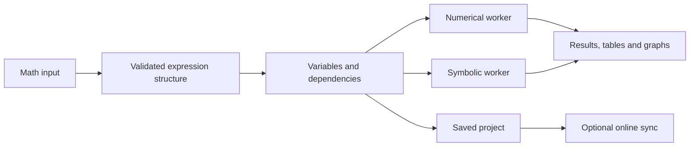

# Graphing Calculator — Detailed Execution Plan

Status: Implementation underway. The web and macOS workspace has a working 2D/3D graphing core, initial maths tools, first geometry tools, and an initial linked spreadsheet. Geometry, spreadsheet, full CAS, authoring, classroom, and resource-library work below is being delivered in stages.

Prepared: 7 October 2026.
Expanded after the GeoGebra feature comparison: 8 October 2026.

## Product direction

Build an offline-capable maths workspace for secondary-school and university students, with a shared foundation for the web and macOS apps. It will cover every feature category selected, with advanced tools introduced progressively so the interface stays approachable.

The core will run without an account, internet connection, or paid AI API. Online services will support accounts, sharing, backups, and collaboration. Mobile will follow once the desktop experience is stable.

The design references are Desmos and GeoGebra. The interface should be simple, practical, and visually restrained.

## 1. Define the complete feature scope and the release stages

“Very advanced” needs a concrete meaning so we can verify that the finished product delivers it. Use this feature map:

| Area | Planned capabilities |
|---|---|
| Scientific calculator | Fractions, powers, roots, logarithms, trigonometry, constants, exact and decimal results, calculation history |
| 2D graphing | Functions, implicit equations, inequalities, piecewise functions, domain restrictions, polar and parametric curves |
| Dynamic geometry | Dependent points; lines, segments, rays, vectors, polygons; transformations; conics; measurements; loci and envelopes |
| Graph interaction | User-created sliders, animations, draggable objects, two-way algebra/graphics editing where mathematically defined, tracing, points of interest, tangents, asymptotes, shaded regions |
| 3D graphing and geometry | Explicit and implicit surfaces, parametric surfaces, space curves, geometric solids, surface intersections, cross-sections, fields, polyhedron nets, animated parameters |
| Algebra and CAS | Simplification, expansion, factorisation, rewriting, substitution, symbolic and numerical equation/inequality/system solving |
| Calculus | Derivatives, partial derivatives, definite and indefinite integrals, limits, Taylor series, gradient visualisation, numerical approximations |
| Linear algebra | Matrix arithmetic, determinants, inverses, linear systems, eigenvalues, eigenvectors, transformations |
| Complex numbers | Complex arithmetic, Argand diagrams, magnitude and phase, domain colouring |
| Spreadsheet and statistics | Editable linked cells and datasets, descriptive charts, distributions, regression and residuals, hypothesis tests, confidence intervals |
| Differential equations | Numerical initial-value problems, supported symbolic solutions, systems, slope fields, phase portraits |
| Notebook | Linked calculations, graphs, tables, formatted notes, and code cells |
| Interactive authoring | Checkboxes, input boxes, buttons, dynamic LaTeX text, safe scripting, animations, reusable activities |
| Projects | Autosave, local files, cloud copies, version history, sharing, collaborative editing |
| Export | Graph images, vector exports where applicable, animations, datasets, notebook documents, sampled 3D models |
| Learning assistance | Worked examples, explanations for supported operations, optional local AI assistance |
| Classroom and library | Teacher assignments, live progress, discussions, published simulations, worksheets, and curriculum collections |

Each area will have a documented support list. For example, differential equations will start with ordinary differential equations and systems; a general-purpose partial differential equation solver will be a separate research extension.

The three priorities are **mathematical correctness, responsive graphing, and useful learning workflows**.

### Missing GeoGebra-style features to add

This is the feature checklist for the new scope. A feature is complete only when its objects or results survive save/reopen, update when dependencies change, and have documented limits and representative correctness checks.

| Area | Planned work and completion example |
|---|---|
| Construction tools | Add selectable points, lines, segments, rays, vectors, and polygons to the 2D canvas. A point on a line or intersection must stay constrained when its parent objects move. Support dragging, selection, deletion, labels, and undo. |
| Transformations | Reflect across a point or line; rotate by a chosen angle; translate by a vector; dilate from a centre; invert in a circle. Derived objects must follow source objects and expose their construction rule. |
| Conics | Construct circles, ellipses, parabolas, hyperbolas, and a conic through five valid points. Show degenerate or ambiguous input clearly instead of producing a misleading curve. |
| Measurements and loci | Add live distance, length, angle, perimeter, and area labels. Trace a dependent point as its driver moves; generate a locus or envelope with visible sampling limits and a way to refine it. |
| Two-way algebra/graphics | Editing an expression updates the drawing. Dragging a supported object changes its stored coordinates or parameters and updates its algebra entry. For arbitrary plotted formulas where an inverse edit has no unique meaning, dragging pans or traces only. |
| Full CAS | Add factor, expand, rewrite, simplify, substitute, and solve commands with stated domains and assumptions. Solve equations, inequalities, and systems numerically and symbolically where supported; distinguish exact solutions from approximations. |
| Calculus and matrices | Add symbolic indefinite/definite integration, symbolic limits, Taylor expansions, and partial derivatives. Add matrix addition, multiplication, inversion, determinants, eigenvalues, and eigenvectors with errors for invalid dimensions or singular cases. |
| Graph analysis | Add x/y intercepts, inflection points, vertical/horizontal/slant asymptotes, and tangent-line objects, alongside the existing approximate roots, extrema, intersections, and slope trace. Mark numeric estimates as approximate. |
| 3D constructions | Add spheres, cubes, prisms, pyramids, cylinders, and cones as editable objects. Compute intersection curves of supported surface pairs and plane cross-sections. Unfold supported polyhedra into printable, labelled 2D nets. |
| Spreadsheet and plots | Add project-backed editable cells with formulas and links to construction objects. Create scatter and residual plots; fit linear, exponential, and polynomial models. Add histograms, bar charts, box plots, and stem-and-leaf diagrams. |
| Probability and inference | Visualise Normal, Binomial, Poisson, Student-t, and Chi-squared distributions. Add Z-tests, T-tests, ANOVA, Chi-squared tests, and confidence intervals with explicit assumptions, sample sizes, statistics, and p-values. |
| Interactive activities | Replace the single fixed slider with user-created sliders and ranges. Add checkboxes, equation input boxes, and clickable buttons. Add animation controls and dynamic text that can embed live values and LaTeX. |
| Scripting | Provide a documented, permission-limited activity API for scripted object changes and checking answers. Run scripts only after a deliberate user action; make execution stoppable and prevent imported projects from silently executing code. |
| Classroom and resources | Add teacher-assigned activities, student progress views, live session updates, and discussion tied to activities. Publish and search reusable simulations, worksheets, and curriculum collections with ownership, attribution, reporting, and moderation tools. |
| Mobile and AR | After the shared project and geometry models are stable, build touch-oriented mobile views. Add camera-based AR placement and manipulation of supported 3D models only on devices with suitable platform support and permissions. |

Keep the construction model separate from a drawing's pixels: objects need stable IDs, dependencies, constraints, style, and algebra representations. This model must be established before loci, bidirectional editing, classroom activities, or a resource library can rely on constructions remaining editable.

## 2. Design one workspace with several views

The starting screen will open directly into a usable calculator. Students can immediately type something like `y = x²`, with examples available nearby.

The main layout will contain:

- A **left expression panel** for equations, variables, sliders, and visibility controls.
- A **large central workspace** that can display a 2D graph, a 3D scene, a table, or a notebook.
- A **geometry tool palette** in the 2D and 3D views for creating, constraining, and transforming objects without typing an equation.
- A **contextual inspector** for the selected object’s domain, appearance, precision, and other properties.
- A **compact toolbar** for switching views, undoing changes, opening projects, and exporting.
- An **optional second pane** for comparing graphs or placing a table beside its graph.

These views will share the same variables. Changing `a` in a notebook will update any graph that depends on it.

Geometry and algebra will share one selection state. Clicking a construction highlights its algebra entry and dependencies; editing a supported entry updates the construction. A spreadsheet cell can supply coordinates, parameters, or datasets, so changing the cell refreshes its linked graph or object. Keep drawing tools discoverable without crowding the expression-first workflow.

Use a light default theme, a proper dark theme, familiar Mac typography, restrained borders, and colour primarily to identify mathematical objects. Graphs will have the strongest visual presence.

Secondary-school students will see common tools first. University tools will be available through contextual actions and searchable commands. This changes which controls are visible without changing mathematical behaviour.

Keyboard navigation, readable mathematical notation, colour-independent graph identification, and accessible result tables will be part of the initial design.

## 3. Prove the difficult technical choices before building the full interface

The proposed stack is:

| Component | Proposed technology | Purpose |
|---|---|---|
| Shared application | React, TypeScript, Vite | Build one interactive application for both platforms |
| macOS application | Tauri | Add desktop windows, menus, local files, and packaging |
| Mathematical input | MathLive | Provide structured notation and an on-screen maths keyboard |
| Fast numerical evaluation | A restricted math.js integration | Evaluate graph samples and everyday calculations |
| Symbolic mathematics | SymPy through Pyodide | Run computer algebra locally |
| 2D rendering | Canvas with selected SVG overlays | Draw curves efficiently while keeping labels and controls crisp |
| 3D rendering | Three.js using WebGL 2 | Render interactive mathematical scenes |
| Local persistence | IndexedDB on web; a desktop persistence adapter | Save projects without a server |
| Collaborative editing | Yjs with authenticated transport and durable storage | Merge edits across devices |
| Optional desktop AI | Ollama running local models | Avoid paid inference APIs |

These are proposed choices, subject to the first technical checks. Pyodide includes SymPy and supports background workers; Three.js provides a WebGL 2 renderer. See [Pyodide packages](https://pyodide.org/en/stable/usage/packages-in-pyodide.html), [worker documentation](https://pyodide.org/en/stable/usage/webworker.html), and [Three.js documentation](https://threejs.org/docs/pages/WebGLRenderer.html).

The first checks will establish whether we can:

- Run symbolic calculations offline inside the packaged Mac app.
- Rotate a representative 3D surface smoothly.
- Cancel an expensive calculation without freezing the interface.
- Save and reopen an identical project across web and Mac.
- Package the mathematical runtime within acceptable download and storage limits.

Tauri uses the Mac’s WebKit engine, so test the actual desktop app early, alongside Safari and Chromium browsers. See [Tauri webview documentation](https://v2.tauri.app/reference/webview-versions/).

Decide the supported macOS versions and hardware baseline from those results.

## 4. Build a shared mathematical foundation

Every expression will follow the same pipeline:

The internal expression structure will preserve meaning independently of its visual formatting. This prevents the graph, calculator, and notebook from interpreting the same input differently.

Define consistent rules for implicit multiplication, function names, angle units, real and complex domains, precision, and variable scope. Potentially ambiguous expressions will display their interpreted form.

A dependency system will track relationships such as `a = 2`, `f(x) = a sin(x)`, and `g(x) = f(x) + 1`. Changing `a` will update its dependants. Circular definitions will produce an understandable error.

Extend that dependency system to geometric objects and spreadsheet cells. For example, two points define a line, a circle depends on its centre and radius, and a measured distance depends on both points. Store typed objects with stable IDs, constraints, and editable parameters. Recompute dependants in order when a parent changes; report cycles and unsatisfied constraints without corrupting the saved project. Define which drag operations have a unique algebraic update before enabling two-way editing.

Numerical sampling and symbolic operations will use separate workers. Jobs will have cancellation, resource limits, and identifiers so an older calculation cannot overwrite a newer result.

Results will distinguish exact answers, numerical approximations, conditional answers, and unsupported operations. For example, simplifying `√(x²)` over the reals must preserve `|x|`.

Expression handling will use a restricted mathematical grammar. Arbitrary text will not be executed as JavaScript or Python. Mathematical parsers also need deliberate security boundaries. See [math.js security guidance](https://mathjs.org/docs/expressions/security.html).

## 5. Build reliable 2D graphing, then establish 3D in the same application

For 2D, implement coordinate transforms, grid spacing, zooming, panning, and expression rendering first. Then add adaptive curve sampling, polar and parametric curves, implicit contours, and inequality shading.

The renderer must recognise discontinuities and invalid regions. It should not draw a connecting line across the asymptote of `1/x` or invent real values for `√x` when `x < 0`.

Intersections, roots, extrema, intercepts, inflection points, asymptotes, and tangents will be computed and checked numerically or symbolically where supported. The interface will distinguish approximate locations from exact results and avoid reporting false points near discontinuities. Add `If(...)` style piecewise input as a friendly form of the existing piecewise model, with an explicit default branch and domain behaviour.

Geometry builds on the same viewport: introduce point/line/polygon creation and constrained dragging first, then transformations and conics, then measurements and sampled loci/envelopes. The first usable geometry release should let a student construct a triangle, drag one vertex, and see its sides, angles, perimeter, and area update immediately. Locus and envelope tools will be bounded jobs with cancellation and adjustable sampling resolution.

The first 3D milestone will include explicit surfaces, space curves, axes, camera controls, parameter sliders, and local saving. **Basic 3D will be part of the early working product.**

The advanced 3D implementation will then add:

| Capability | Example |
|---|---|
| Implicit surfaces | `x² + y² + z² = 9` |
| Parametric surfaces | A torus or Möbius strip |
| Animated parameters | A travelling wave with a time slider |
| Cross-sections | Move a plane through a sphere and inspect the intersection |
| Vector fields | Display arrows and streamlines |
| Calculus objects | Tangent planes, normal vectors, gradients |
| Surface inspection | Coordinates, contours, scalar colour maps |
| Complex visualisation | Plot magnitude as height and phase as colour |

Surface generation will happen separately from display. During dragging, the app will use a lighter preview, then refine it when the interaction stops.

Implicit surfaces will use bounded numerical meshing with configurable resolution. The app will explain that very small features may be unresolved at the selected sampling level.

Camera presets, reset-view controls, clipping planes, orthographic and perspective views, wireframes, and transparency will make complex scenes easier to inspect.

Add 3D solids as editable constructions with dimensions and orientation, then compute supported surface/surface and surface/plane intersection curves with numerical error estimates. Polyhedron nets will begin with cubes, prisms, and pyramids whose faces can be unfolded without overlap; export labelled, printable 2D layouts. AR belongs to the later mobile phase: reuse the same 3D object model and provide a conventional 3D fallback where camera or AR support is unavailable.

## 6. Add algebra, calculus, statistics, and differential equations as tested modules

Put a common adapter around the maths engines so each feature has consistent inputs, outputs, assumptions, errors, and cancellation behaviour.

Algebra will extend the present calculator with expansion, factorisation, rewriting, substitution, and symbolic/numerical solving for equations, inequalities, and systems. Calculus will add exact derivatives, partial derivatives, indefinite and definite integrals, limits, and Taylor series, with numeric methods when exact results are unavailable. Each result will show assumptions, domains, and whether it is exact or approximate.

Matrices and vectors will add arithmetic, determinants, inverses, eigenvalues, and eigenvectors and connect to visual demonstrations: for example, changing a matrix can transform a set of vectors in a graph. The present matrix tool only returns a determinant and inverse for 2×2 to 4×4 square matrices; general matrix operations need separate inputs and result displays.

Statistics will connect an editable, saved spreadsheet to scatter plots, fitted functions, and residuals. Fit linear, exponential, and polynomial models and display fit quality and residual patterns. Add histograms, bar charts, box plots, and stem-and-leaf diagrams before probability and inference tools. Model Normal, Binomial, Poisson, Student-t, and Chi-squared distributions with parameter controls and shaded probabilities. Z-tests, T-tests, ANOVA, Chi-squared tests, and confidence intervals will show assumptions, sample sizes, test statistics, p-values, and an interpretation that does not overstate a result. Missing values, invalid cells, and sample-versus-population calculations will have explicit handling.

Differential equations will connect initial conditions to numerical solution curves, slope fields, and phase portraits. Solver tolerances and failures will be visible when they affect interpretation.

**Worked explanations will be a separate capability from obtaining an answer.** Build reliable step sequences for supported problem families, such as linear equations, quadratics, and common differentiation rules. A symbolic result alone will not be presented as a complete educational derivation.

## 7. Make projects, notebooks, and scripting work offline

A project will contain expressions, geometric constructions and their dependencies, variables, spreadsheet cells and datasets, graph settings, notebook cells, interactive controls, activity scripts, and references to imported assets. Derived meshes and other large temporary results will normally be regenerated.

The file format will be versioned, with migrations for older projects. Saving will include autosave, explicit export, recovery after interruption, and checks for damaged files.

On macOS, the core mathematical assets will be bundled. On the web, an offline setup will download and verify the required assets before reporting that the calculator is ready offline. Browser storage can be cleared, so downloadable project files will remain available as backups.

Notebook cells will support text, calculations, graphs, tables, and Python code. Code cells will run explicitly and display whether their outputs are current.

Scripting will have a separate execution boundary, limited project access, and a stop control. Opening someone else’s notebook will not automatically execute its code. A background worker alone will not be treated as a security sandbox.

Authoring controls will be stored as objects: custom sliders expose variable, range, step, and animation settings; checkboxes control visibility; input boxes bind to a selected expression or value; buttons trigger named, permitted actions. Dynamic text combines plain text, live values, and LaTeX fragments without running code. Activity scripting will expose only validated commands through a constrained API; any JavaScript support needs isolation, resource limits, clear trust prompts, and test coverage for imported activities.

Export will be format-specific: SVG for suitable 2D graphs, PNG for rendered views, sampled meshes for 3D models, CSV for data, and supported video or image formats for animations. The exported object’s sampling resolution will be recorded where relevant.

## 8. Add accounts and collaboration once local projects are dependable

Students will be able to use the calculator anonymously. Signing in will enable cloud copies and collaboration.

Shared projects will have owner, editor, and viewer permissions. Sharing will support read-only links, editable invitations, link revocation, and creating a personal copy.

Classroom roles build on these permissions: teachers can assign a versioned activity, students can work privately or in a supervised live session, and teachers can see progress on specified tasks in real time. Discussions will attach to an activity or session and need moderation and retention controls. A student's private projects will not become visible merely because they joined a class.

Yjs will manage concurrent document edits. It supports local persistence and offline editing, but we will still need authenticated connections, durable server storage, and recovery logic. See [Yjs offline support](https://docs.yjs.dev/getting-started/allowing-offline-editing).

Synchronise expressions, notes, datasets, and deliberate settings changes. Camera movement and cursor presence will be separate, temporary state; one student rotating a scene should not unexpectedly rotate everyone else’s view. A “follow presenter” option can enable that intentionally.

Reconnection will retrieve missed updates and merge local edits. The system will distinguish “saved on this device” from “synced online.” Removing someone’s access will also prevent their queued edits from being accepted later.

The resource library will publish opt-in copies of activities, simulations, worksheets, and curriculum collections. Support search, tags, versioned updates, attribution/licensing, duplication into a personal workspace, reporting, and moderation. A shared resource must open safely without automatically executing its scripts.

For a starting backend, Supabase is a candidate if the available free hosting arrangement does not already provide authentication, storage, and realtime transport. Its free plan has storage, traffic, and connection limits, so size collaboration against those limits before selecting it. See [Supabase pricing and quotas](https://supabase.com/pricing).

## 9. Add AI without introducing paid API dependencies

The first AI integration will target the Mac app through a locally installed Ollama runtime with cloud features disabled. Ollama documents a local-only configuration. See [Ollama documentation](https://docs.ollama.com/faq).

The assistant can explain selected expressions, suggest a graph, describe parameter changes, or help interpret an error. Proposed expressions will pass through the same parser and maths engine as manually entered ones.

Mathematical checks will verify candidate results where possible, while explanations will remain clearly identified as AI assistance. We will not claim that every generated explanation can be proved correct automatically.

Model selection will follow tests of memory use, response speed, mathematical usefulness, and licence terms. Students will see download size and hardware requirements before enabling it.

Browser AI will be a later optional capability using a runtime such as WebLLM, which runs models through WebGPU. Availability will depend on the browser and hardware. See [WebLLM documentation](https://webllm.mlc.ai/).

This avoids per-token charges, but local AI still consumes storage, memory, battery, and processing time. Students whose devices cannot run it will retain the complete calculator and the built-in learning material.

## 10. Verify correctness, performance, and student usability throughout development

Mathematical tests will use known answers, independent reference values, and property checks. Include cases such as:

| Test | Expected behaviour |
|---|---|
| `1/x` | Separate branches with no line across zero |
| `sin(x)/x` | Preserve the undefined point unless an extension is explicitly defined |
| `√(x²)` | Respect the variable’s domain and assumptions |
| Singular matrix inverse | Explain that the inverse does not exist |
| Sphere surface | Sampled vertices satisfy the equation within the chosen tolerance |
| Numerical ODE solution | Agree with a known analytic solution within tolerance |
| Simultaneous edits | Converge without losing unrelated changes |
| Offline restart | Recover saved work with network access disabled |

Performance targets will be measured against documented scenes on a baseline student laptop. Initial targets are input feedback within about 100 milliseconds for ordinary expressions, smooth 2D interaction, and at least 30 frames per second for representative 3D scenes.

These are targets to validate, not claims about arbitrary equations. Expensive operations will show progress and remain cancellable.

Test keyboard use, screen-reader access to expressions and results, zoomed text, colour contrast, file recovery, collaboration permissions, and the actual packaged Mac app.

Usability sessions will include both secondary-school and university students completing tasks such as plotting a function, investigating a parameter, importing data, and sharing a project. Findings will determine which tools need clearer labels or simpler access.

## 11. Deliver the product through concrete milestones

| Phase | Deliverable | Completion condition |
|---|---|---|
| 0 — Technical validation | Offline maths, rendering, and persistence prototypes | Critical choices work in browsers and the Mac app |
| 1 — Foundation | Shared expression/project models, workers, undo, saving, and object dependency model | Expressions and dependent objects save, reopen, and recompute reliably |
| 2 — Working graphing alpha | 2D/3D plots, basic parameter control, analysis, local exports | Students can complete representative graphing tasks offline; this phase is partly implemented |
| 3 — Dynamic geometry | Points, lines, segments, rays, vectors, polygons, constrained dragging, transformations, conics, measurements, loci, envelopes | A saved construction survives dragging and reopen while dependent measurements stay correct; the first point, shape, distance, angle, perimeter, and area tools are implemented |
| 4 — Algebra and graph analysis | Two-way editing for supported objects; full CAS commands, equation/inequality/system solving, calculus, matrix arithmetic and eigen operations; intercepts, inflections, asymptotes, tangent objects | Defined operation set passes correctness and domain checks; approximate answers are labelled |
| 5 — Spreadsheet and statistics | Linked cells, scatter/residual plots, regression families, descriptive charts, distributions, tests, confidence intervals | Editing cells updates linked plots and statistical outputs with assumptions shown |
| 6 — Advanced 3D | Solids, surface intersections, cross-sections, fields, labelled printable nets, scene inspection | Saved 3D constructions and representative demanding scenes meet accuracy and performance targets |
| 7 — Interactive study workspace | Custom sliders and animations, checkboxes, input boxes, buttons, dynamic LaTeX text, notebooks, safe activity scripts, explanations, broader exports | A student can complete and reopen an interactive assignment without hidden code execution |
| 8 — Online collaboration and classroom | Accounts, permissions, syncing, shared editing, teacher assignments, live progress, moderated discussion | Reconnection and concurrent edits pass checks; class visibility respects permissions |
| 9 — Resource library | Publish, search, copy, attribute, version, and moderate activities, worksheets, simulations, and curricula | Shared resources open safely and can be copied into an editable project |
| 10 — Optional AI | Local Mac assistant; browser feasibility evaluation | Works without paid APIs and fails gracefully on unsupported hardware |
| 11 — Release | Tested web deployment, Mac distribution, documentation | Release criteria pass on the supported platform matrix |
| Later — Mobile and AR | Touch layouts, mobile performance work, camera-based placement of supported 3D objects | Core tasks work on smaller screens; AR has permission handling and a 3D fallback |

The dependency path is **shared object model → dynamic geometry and linked spreadsheet → authoring activities → classroom → resource library**. CAS, graph analysis, and advanced 3D can advance alongside that path once their numerical/symbolic workers and project format are stable. Mobile and AR reuse these models after the desktop/web workflows are established.

Testing and student feedback will occur within each phase. A phase will finish with a working demonstration and its known limitations recorded. Track each GeoGebra-style item above as implemented, partial, or planned; do not call a phase complete because one example works.

A useful graphing alpha will arrive well before the full product. The expanded geometry, full CAS, spreadsheet, classroom, library, and mobile/AR scope is a **multi-year product effort for one developer**, not a short follow-on to the existing alpha. Re-estimate each phase after technical prototypes and student feedback; prioritize a usable release over claiming complete GeoGebra feature parity at once.

## 12. Keep deployment costs and future mobile support explicit

Heavy computation will stay on students’ devices. Cloud storage will primarily hold project data and uploaded assets, with quotas and compact updates to control usage. Confirm the available host’s capabilities before committing the backend.

There is one separate distribution cost to account for: normal signed and notarised Mac distribution generally involves Apple Developer membership. At the time of planning, Apple lists it at US$99 per year, with fee waivers for qualifying organisations. Local development and testing can precede that decision. See [Apple membership](https://developer.apple.com/programs/enroll/) and [Mac distribution guidance](https://tauri.app/distribute/).

For mobile, preserve reusable maths engines, geometry objects, project formats, and synchronisation protocols from the beginning. The phone interface will receive its own touch-oriented layout and performance budget later. AR needs a separate capability check for camera access, world tracking, device performance, and platform permissions; users can still inspect the same model in ordinary 3D.

## First implementation milestone

A real web-and-Mac calculator that saves locally, plots reliable 2D graphs, displays interactive 3D surfaces, and runs its core calculations offline. It will establish the foundation on which the full roadmap can be built and tested.

Current progress: the web and macOS apps support editable 2D functions, polar and parametric curves, implicit 2D equations, shaded inequalities, piecewise functions, domain restrictions, explicit 3D surfaces, parametric and implicit 3D surfaces, parametric 3D space curves, user-created parameter sliders with editable ranges, steps, and play/pause animation with saved sweep time, local autosave, project import/export, graph image export, and session undo/redo for project edits. The 2D geometry toolbar creates free and spreadsheet-linked points, lines, segments, rays, vectors, polygons, dynamic circles, ellipses, and quadratic conics fitted through five movable points. Point placement snaps to constructed line/path intersections and stores those intersection points as dependent constructions. A rotation locus follows a moving point around a selected center; a parameterized line family can generate a numerically sampled envelope. Perimeter/area measurements can reference transformed polygons. Paths and polygons store references to their point objects, so dragging a point moves its dependent shapes; deleting a point removes those dependants. Distance and angle measurements reference points, while perimeter and area measurements reference polygons; their displayed values update when source points move. Geometry, measurements, and transformations are saved in project files. Transformations now create linked copies of points, paths, and polygons: translation, reflection across either axis or the origin, rotation about a coordinate center, dilation about a coordinate center, and circle inversion. The copies update as source points move, and deleting a source point removes dependent transformed constructions. Remaining geometry limits include arbitrary-line reflection, general conics beyond the five-point quadratic fit, non-rotational loci, general envelope families, comprehensive snapping in every construction tool, and measurements beyond transformed polygon perimeter/area. The Spreadsheet view stores editable cells across multiple sheets in the project, evaluates formulas with same-sheet and cross-sheet references, detects formula errors and cycles, and can use valid one-letter workspace variables in formulas. Active-sheet cell values also feed graph expressions by address (for example, A2). Columns A and B feed a live scatter plot with selectable linear, exponential, and quadratic regression models, R², a residual plot, and listed residual values. The chart view also provides a histogram, bar chart, box plot, and stem-and-leaf display from the selected numeric column or paired A/B data. Its probability calculator evaluates density or point mass and cumulative probability for Normal, Binomial, Poisson, Student-t, and Chi-squared distributions, with parameter validation and distribution-specific guidance. One-sample t-tests, z-tests, and mean confidence intervals can run on a selected data column, reporting sample statistics, test statistic and p-value, or interval bounds with assumptions. The inference view also runs one-way ANOVA across selected columns and a chi-squared goodness-of-fit test using observed and expected count columns, checking sample sizes, expected counts, and matching totals. It now adds pooled-variance pairwise t comparisons with Bonferroni adjustment and Pearson chi-squared independence tests from selected spreadsheet columns. Cell references from geometry, polynomial degrees beyond two, distribution plots, proportion intervals, and broader inference options remain future work. Single-letter scalar definitions can depend on parameter sliders or one another, appear in any row order, and feed 2D or 3D graphs; cycles, duplicate names, and invalid definitions show errors. Explicit 2D functions have click-to-trace, estimated tangent slopes, and approximate roots, turning points, and intersections within the visible view. Advanced 3D meshing runs in a cancellable numerical worker. The Maths tools view provides expression expansion, numeric quadratic factorisation, substitution, partial derivatives, symbolic gradients and Hessian matrices, Taylor polynomials through degree eight, symbolic antiderivatives for supported polynomial and linear-chain common-function forms, rectangular matrix arithmetic, transpose, determinant, inverse, real-matrix eigenvalues, numeric linear-system solutions, and bounded numerical root search for higher-degree or non-polynomial equations. Limit tools use direct substitution and repeated l’Hôpital reduction for supported quotient forms, with numerical probing as a fallback. The numerical search refines sign changes and may miss even-multiplicity roots. The production web build includes a service worker. Both graph views were checked in an earlier packaged Mac app; the current package was checked for Maths tools and parameter playback. The CAS tools are intentionally bounded: higher-degree and non-polynomial solving is numerical over a user-selected interval; symbolic integration, limits, and assumptions support a documented subset rather than a general-purpose CAS. The 3D tools include editable solids, explicit-surface intersection curves, solid cross-sections, sampled vector fields, and printable cube and square-pyramid nets; general implicit/parametric surface intersections, cross-sections of arbitrary surfaces, and nets for other polyhedra remain future work. The inference extensions currently include pooled-variance pairwise comparisons with Bonferroni adjustment and Pearson chi-squared independence tests; broader post-hoc methods and inference diagnostics remain future work. An initial offline notebook now saves note cells with inline LaTeX and live variable values, calculation cells, graph-visibility checkboxes, parameter input boxes, linked 2D graph previews, spreadsheet snapshots, and safe action buttons (toggle an expression or set a parameter) in versioned project files. Action cells expose only these fixed operations; imported code is never executed. Numerical limit tools can select left-hand, right-hand, or two-sided probing, while symbolic limit support remains limited to direct substitution and supported quotient l’Hôpital reductions. New projects start blank; untouched autosaved demo projects are migrated to blank workspaces. Classroom collaboration, resource library, mobile, and AR features are still later roadmap items.

Implementation scope note: this milestone implements the requested CAS, dynamic geometry, spreadsheet/statistics, and advanced 3D feature families as useful offline-first tools. Numerical methods expose their sampling or interval limits in the interface where relevant; these features do not claim the generality or mathematical guarantees of a mature symbolic CAS or full GeoGebra construction engine.

## Remaining work toward the full roadmap

This is a working offline calculator, not a completed GeoGebra-equivalent product. The next implementation work is:

1. Expand the notebook into full activity authoring. Notes, calculations, graph visibility and parameter inputs now sit alongside linked 2D graph previews, spreadsheet table snapshots, and action buttons restricted to toggling a graph or setting a parameter. Still needed: editable graph/table cells, richer guided explanations, safe isolated scripts, larger export formats, and activity templates.
2. Broaden mathematical coverage: a more general CAS with explicit domain/assumption handling, wider geometry constructions and editable graph-to-equation links, additional inference methods and distribution plots, and more general 3D intersections, cross-sections, and nets. Limit probes now allow left, right, or two-sided approaches; they remain numerical unless a supported direct-substitution or l’Hôpital case applies. Numerical results need more reference cases and error bounds.
3. Build the online platform: account and permission model, sync and conflict handling, shared editing, teacher assignments and progress, and a moderated searchable resource library. Offline projects must remain usable without an account.
4. Evaluate a no-paid-API local assistant, then complete cross-browser and Mac release testing, accessibility and performance checks, signed Mac distribution, and deployment documentation. Mobile and AR remain later work.

Each phase above needs its own design, implementation, and validation. These additions advance phases 4 and 7, but the current code does not satisfy the completion conditions for phases 4 through 11.
