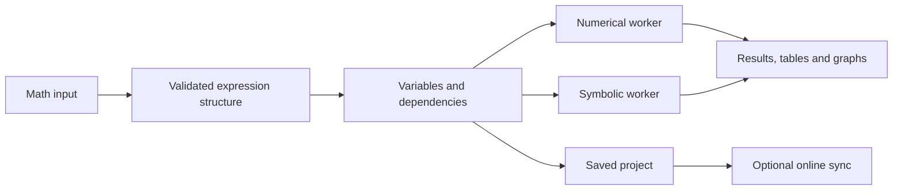

# Graphing Calculator — Detailed Execution Plan

Status: Implementation underway. The web and macOS workspace now supports explicit 2D and 3D graphs, parametric 3D space curves, live maths input, polar and parametric 2D curves, implicit 2D curves, shaded inequalities, and initial 2D graph analysis; the full roadmap remains in progress.

Prepared: 7 October 2026.

## Product direction

Build an offline-capable maths workspace for secondary-school and university students, with a shared foundation for the web and macOS apps. It will cover every feature category selected, with advanced tools introduced progressively so the interface stays approachable.

The core will run without an account, internet connection, or paid AI API. Online services will support accounts, sharing, backups, and collaboration. Mobile will follow once the desktop experience is stable.

The design references are Desmos and GeoGebra. The interface should be simple, practical, and visually restrained.

## 1. Define the complete feature scope and the release stages

“Very advanced” needs a concrete meaning so we can verify that the finished product delivers it. Use this feature map:

| Area | Planned capabilities |
|---|---|
| Scientific calculator | Fractions, powers, roots, logarithms, trigonometry, constants, exact and decimal results, calculation history |
| 2D graphing | Functions, implicit equations, inequalities, piecewise functions, domain restrictions, polar and parametric curves |
| Graph interaction | Sliders, animations, draggable points, tracing, intersections, roots, extrema, tangents, shaded regions |
| 3D graphing | Explicit and implicit surfaces, parametric surfaces, space curves, vectors, planes, cross-sections, contours, animated parameters |
| Algebra | Simplification, expansion, factorisation, substitution, equation solving, systems of equations |
| Calculus | Derivatives, partial derivatives, integrals, limits, series, gradient visualisation, numerical approximations |
| Linear algebra | Matrices, determinants, inverses, linear systems, eigenvalues, eigenvectors, transformations |
| Complex numbers | Complex arithmetic, Argand diagrams, magnitude and phase, domain colouring |
| Statistics | Editable datasets, descriptive statistics, distributions, regression, residual plots, correlation |
| Differential equations | Numerical initial-value problems, supported symbolic solutions, systems, slope fields, phase portraits |
| Notebook | Linked calculations, graphs, tables, formatted notes, and code cells |
| Projects | Autosave, local files, cloud copies, version history, sharing, collaborative editing |
| Export | Graph images, vector exports where applicable, animations, datasets, notebook documents, sampled 3D models |
| Learning assistance | Worked examples, explanations for supported operations, optional local AI assistance |

Each area will have a documented support list. For example, differential equations will start with ordinary differential equations and systems; a general-purpose partial differential equation solver will be a separate research extension.

The three priorities are **mathematical correctness, responsive graphing, and useful learning workflows**.

## 2. Design one workspace with several views

The starting screen will open directly into a usable calculator. Students can immediately type something like `y = x²`, with examples available nearby.

The main layout will contain:

- A **left expression panel** for equations, variables, sliders, and visibility controls.
- A **large central workspace** that can display a 2D graph, a 3D scene, a table, or a notebook.
- A **contextual inspector** for the selected object’s domain, appearance, precision, and other properties.
- A **compact toolbar** for switching views, undoing changes, opening projects, and exporting.
- An **optional second pane** for comparing graphs or placing a table beside its graph.

These views will share the same variables. Changing `a` in a notebook will update any graph that depends on it.

Use a light default theme, a proper dark theme, familiar Mac typography, restrained borders, and colour primarily to identify mathematical objects. Graphs will have the strongest visual presence.

Secondary-school students will see common tools first. University tools will be available through contextual actions and searchable commands. This changes which controls are visible without changing mathematical behaviour.

Keyboard navigation, readable mathematical notation, colour-independent graph identification, and accessible result tables will be part of the initial design.

## 3. Prove the difficult technical choices before building the full interface

The proposed stack is:

| Component | Proposed technology | Purpose |
|---|---|---|
| Shared application | React, TypeScript, Vite | Build one interactive application for both platforms |
| macOS application | Tauri | Add desktop windows, menus, local files, and packaging |
| Mathematical input | MathLive | Provide structured notation and an on-screen maths keyboard |
| Fast numerical evaluation | A restricted math.js integration | Evaluate graph samples and everyday calculations |
| Symbolic mathematics | SymPy through Pyodide | Run computer algebra locally |
| 2D rendering | Canvas with selected SVG overlays | Draw curves efficiently while keeping labels and controls crisp |
| 3D rendering | Three.js using WebGL 2 | Render interactive mathematical scenes |
| Local persistence | IndexedDB on web; a desktop persistence adapter | Save projects without a server |
| Collaborative editing | Yjs with authenticated transport and durable storage | Merge edits across devices |
| Optional desktop AI | Ollama running local models | Avoid paid inference APIs |

These are proposed choices, subject to the first technical checks. Pyodide includes SymPy and supports background workers; Three.js provides a WebGL 2 renderer. See [Pyodide packages](https://pyodide.org/en/stable/usage/packages-in-pyodide.html), [worker documentation](https://pyodide.org/en/stable/usage/webworker.html), and [Three.js documentation](https://threejs.org/docs/pages/WebGLRenderer.html).

The first checks will establish whether we can:

- Run symbolic calculations offline inside the packaged Mac app.
- Rotate a representative 3D surface smoothly.
- Cancel an expensive calculation without freezing the interface.
- Save and reopen an identical project across web and Mac.
- Package the mathematical runtime within acceptable download and storage limits.

Tauri uses the Mac’s WebKit engine, so test the actual desktop app early, alongside Safari and Chromium browsers. See [Tauri webview documentation](https://v2.tauri.app/reference/webview-versions/).

Decide the supported macOS versions and hardware baseline from those results.

## 4. Build a shared mathematical foundation

Every expression will follow the same pipeline:

The internal expression structure will preserve meaning independently of its visual formatting. This prevents the graph, calculator, and notebook from interpreting the same input differently.

Define consistent rules for implicit multiplication, function names, angle units, real and complex domains, precision, and variable scope. Potentially ambiguous expressions will display their interpreted form.

A dependency system will track relationships such as `a = 2`, `f(x) = a sin(x)`, and `g(x) = f(x) + 1`. Changing `a` will update its dependants. Circular definitions will produce an understandable error.

Numerical sampling and symbolic operations will use separate workers. Jobs will have cancellation, resource limits, and identifiers so an older calculation cannot overwrite a newer result.

Results will distinguish exact answers, numerical approximations, conditional answers, and unsupported operations. For example, simplifying `√(x²)` over the reals must preserve `|x|`.

Expression handling will use a restricted mathematical grammar. Arbitrary text will not be executed as JavaScript or Python. Mathematical parsers also need deliberate security boundaries. See [math.js security guidance](https://mathjs.org/docs/expressions/security.html).

## 5. Build reliable 2D graphing, then establish 3D in the same application

For 2D, implement coordinate transforms, grid spacing, zooming, panning, and expression rendering first. Then add adaptive curve sampling, polar and parametric curves, implicit contours, and inequality shading.

The renderer must recognise discontinuities and invalid regions. It should not draw a connecting line across the asymptote of `1/x` or invent real values for `√x` when `x < 0`.

Intersections, roots, and extrema will be computed and checked numerically or symbolically where supported. The interface will distinguish approximate locations from exact results.

The first 3D milestone will include explicit surfaces, space curves, axes, camera controls, parameter sliders, and local saving. **Basic 3D will be part of the early working product.**

The advanced 3D implementation will then add:

| Capability | Example |
|---|---|
| Implicit surfaces | `x² + y² + z² = 9` |
| Parametric surfaces | A torus or Möbius strip |
| Animated parameters | A travelling wave with a time slider |
| Cross-sections | Move a plane through a sphere and inspect the intersection |
| Vector fields | Display arrows and streamlines |
| Calculus objects | Tangent planes, normal vectors, gradients |
| Surface inspection | Coordinates, contours, scalar colour maps |
| Complex visualisation | Plot magnitude as height and phase as colour |

Surface generation will happen separately from display. During dragging, the app will use a lighter preview, then refine it when the interaction stops.

Implicit surfaces will use bounded numerical meshing with configurable resolution. The app will explain that very small features may be unresolved at the selected sampling level.

Camera presets, reset-view controls, clipping planes, orthographic and perspective views, wireframes, and transparency will make complex scenes easier to inspect.

## 6. Add algebra, calculus, statistics, and differential equations as tested modules

Put a common adapter around the maths engines so each feature has consistent inputs, outputs, assumptions, errors, and cancellation behaviour.

Algebra will start with simplification, substitution, factorisation, and equation solving. Calculus will add derivatives, integrals, limits, and series, followed by multivariable operations.

Matrices and vectors will connect to visual demonstrations: for example, changing a matrix can transform a set of vectors in a graph.

Statistics will connect editable tables to scatter plots, fitted functions, and residuals. Missing values, invalid cells, and sample-versus-population calculations will have explicit handling.

Differential equations will connect initial conditions to numerical solution curves, slope fields, and phase portraits. Solver tolerances and failures will be visible when they affect interpretation.

**Worked explanations will be a separate capability from obtaining an answer.** Build reliable step sequences for supported problem families, such as linear equations, quadratics, and common differentiation rules. A symbolic result alone will not be presented as a complete educational derivation.

## 7. Make projects, notebooks, and scripting work offline

A project will contain expressions, variables, datasets, graph settings, notebook cells, and references to imported assets. Derived meshes and other large temporary results will normally be regenerated.

The file format will be versioned, with migrations for older projects. Saving will include autosave, explicit export, recovery after interruption, and checks for damaged files.

On macOS, the core mathematical assets will be bundled. On the web, an offline setup will download and verify the required assets before reporting that the calculator is ready offline. Browser storage can be cleared, so downloadable project files will remain available as backups.

Notebook cells will support text, calculations, graphs, tables, and Python code. Code cells will run explicitly and display whether their outputs are current.

Scripting will have a separate execution boundary, limited project access, and a stop control. Opening someone else’s notebook will not automatically execute its code. A background worker alone will not be treated as a security sandbox.

Export will be format-specific: SVG for suitable 2D graphs, PNG for rendered views, sampled meshes for 3D models, CSV for data, and supported video or image formats for animations. The exported object’s sampling resolution will be recorded where relevant.

## 8. Add accounts and collaboration once local projects are dependable

Students will be able to use the calculator anonymously. Signing in will enable cloud copies and collaboration.

Shared projects will have owner, editor, and viewer permissions. Sharing will support read-only links, editable invitations, link revocation, and creating a personal copy.

Yjs will manage concurrent document edits. It supports local persistence and offline editing, but we will still need authenticated connections, durable server storage, and recovery logic. See [Yjs offline support](https://docs.yjs.dev/getting-started/allowing-offline-editing).

Synchronise expressions, notes, datasets, and deliberate settings changes. Camera movement and cursor presence will be separate, temporary state; one student rotating a scene should not unexpectedly rotate everyone else’s view. A “follow presenter” option can enable that intentionally.

Reconnection will retrieve missed updates and merge local edits. The system will distinguish “saved on this device” from “synced online.” Removing someone’s access will also prevent their queued edits from being accepted later.

For a starting backend, Supabase is a candidate if the available free hosting arrangement does not already provide authentication, storage, and realtime transport. Its free plan has storage, traffic, and connection limits, so size collaboration against those limits before selecting it. See [Supabase pricing and quotas](https://supabase.com/pricing).

## 9. Add AI without introducing paid API dependencies

The first AI integration will target the Mac app through a locally installed Ollama runtime with cloud features disabled. Ollama documents a local-only configuration. See [Ollama documentation](https://docs.ollama.com/faq).

The assistant can explain selected expressions, suggest a graph, describe parameter changes, or help interpret an error. Proposed expressions will pass through the same parser and maths engine as manually entered ones.

Mathematical checks will verify candidate results where possible, while explanations will remain clearly identified as AI assistance. We will not claim that every generated explanation can be proved correct automatically.

Model selection will follow tests of memory use, response speed, mathematical usefulness, and licence terms. Students will see download size and hardware requirements before enabling it.

Browser AI will be a later optional capability using a runtime such as WebLLM, which runs models through WebGPU. Availability will depend on the browser and hardware. See [WebLLM documentation](https://webllm.mlc.ai/).

This avoids per-token charges, but local AI still consumes storage, memory, battery, and processing time. Students whose devices cannot run it will retain the complete calculator and the built-in learning material.

## 10. Verify correctness, performance, and student usability throughout development

Mathematical tests will use known answers, independent reference values, and property checks. Include cases such as:

| Test | Expected behaviour |
|---|---|
| `1/x` | Separate branches with no line across zero |
| `sin(x)/x` | Preserve the undefined point unless an extension is explicitly defined |
| `√(x²)` | Respect the variable’s domain and assumptions |
| Singular matrix inverse | Explain that the inverse does not exist |
| Sphere surface | Sampled vertices satisfy the equation within the chosen tolerance |
| Numerical ODE solution | Agree with a known analytic solution within tolerance |
| Simultaneous edits | Converge without losing unrelated changes |
| Offline restart | Recover saved work with network access disabled |

Performance targets will be measured against documented scenes on a baseline student laptop. Initial targets are input feedback within about 100 milliseconds for ordinary expressions, smooth 2D interaction, and at least 30 frames per second for representative 3D scenes.

These are targets to validate, not claims about arbitrary equations. Expensive operations will show progress and remain cancellable.

Test keyboard use, screen-reader access to expressions and results, zoomed text, colour contrast, file recovery, collaboration permissions, and the actual packaged Mac app.

Usability sessions will include both secondary-school and university students completing tasks such as plotting a function, investigating a parameter, importing data, and sharing a project. Findings will determine which tools need clearer labels or simpler access.

## 11. Deliver the product through concrete milestones

| Phase | Deliverable | Completion condition |
|---|---|---|
| 0 — Technical validation | Offline maths, rendering, and persistence prototypes | Critical choices work in browsers and the Mac app |
| 1 — Foundation | Workspace, mathematical input, project model, workers, undo and saving | Enter, evaluate, save, and reopen calculations reliably |
| 2 — Working graphing alpha | Strong 2D graphing, basic 3D, sliders, local exports | Students can complete representative graphing tasks offline |
| 3 — Mathematical breadth | Algebra, calculus, matrices, complex numbers, statistics, ODE tools | Defined feature coverage passes mathematical checks |
| 4 — Advanced exploration | Implicit and parametric 3D, fields, cross-sections, advanced animations | Representative demanding scenes meet accuracy and performance targets |
| 5 — Study workspace | Notebooks, scripting, explanations, broader exports | Complete assignments can be created and reopened |
| 6 — Online collaboration | Accounts, permissions, syncing, shared editing, history | Reconnection and concurrent editing tests pass |
| 7 — Optional AI | Local Mac assistant; browser feasibility evaluation | Works without paid APIs and fails gracefully on unsupported hardware |
| 8 — Release | Tested web deployment, Mac distribution, documentation | Release criteria pass on the supported platform matrix |
| Later — Mobile | Touch layouts and mobile performance work | Core tasks work comfortably on smaller screens |

Testing and student feedback will occur within each phase. A phase will finish with a working demonstration and its known limitations recorded.

A useful graphing alpha will arrive well before the full product. For planning purposes, this breadth represents **many months of engineering; roughly 6–12+ months for one experienced developer is a more credible initial allowance than a short website build**. Revise that estimate after Phase 0, especially for symbolic explanations, implicit 3D, and collaboration.

## 12. Keep deployment costs and future mobile support explicit

Heavy computation will stay on students’ devices. Cloud storage will primarily hold project data and uploaded assets, with quotas and compact updates to control usage. Confirm the available host’s capabilities before committing the backend.

There is one separate distribution cost to account for: normal signed and notarised Mac distribution generally involves Apple Developer membership. At the time of planning, Apple lists it at US$99 per year, with fee waivers for qualifying organisations. Local development and testing can precede that decision. See [Apple membership](https://developer.apple.com/programs/enroll/) and [Mac distribution guidance](https://tauri.app/distribute/).

For mobile, preserve reusable maths engines, project formats, and synchronisation protocols from the beginning. The phone interface will receive its own touch-oriented layout and performance budget later.

## First implementation milestone

A real web-and-Mac calculator that saves locally, plots reliable 2D graphs, displays interactive 3D surfaces, and runs its core calculations offline. It will establish the foundation on which the full roadmap can be built and tested.

Current progress: the web and macOS apps support editable 2D functions, polar and parametric curves, implicit 2D equations, shaded inequalities, explicit 3D surfaces, parametric 3D space curves, a parameter slider, local autosave, project import/export, graph image export, and session undo/redo for project edits. Explicit 2D functions have click-to-trace, estimated tangent slopes, and approximate roots, turning points, and intersections within the visible view. The production web build includes a service worker. Both graph views have been checked in the packaged Mac app, and a project file was exported there. Next foundation work is the shared expression structure, dependency tracking, and cancellable numerical workers. Advanced 3D surfaces, symbolic maths, accounts, collaboration, notebooks, and optional local AI remain on the roadmap.
